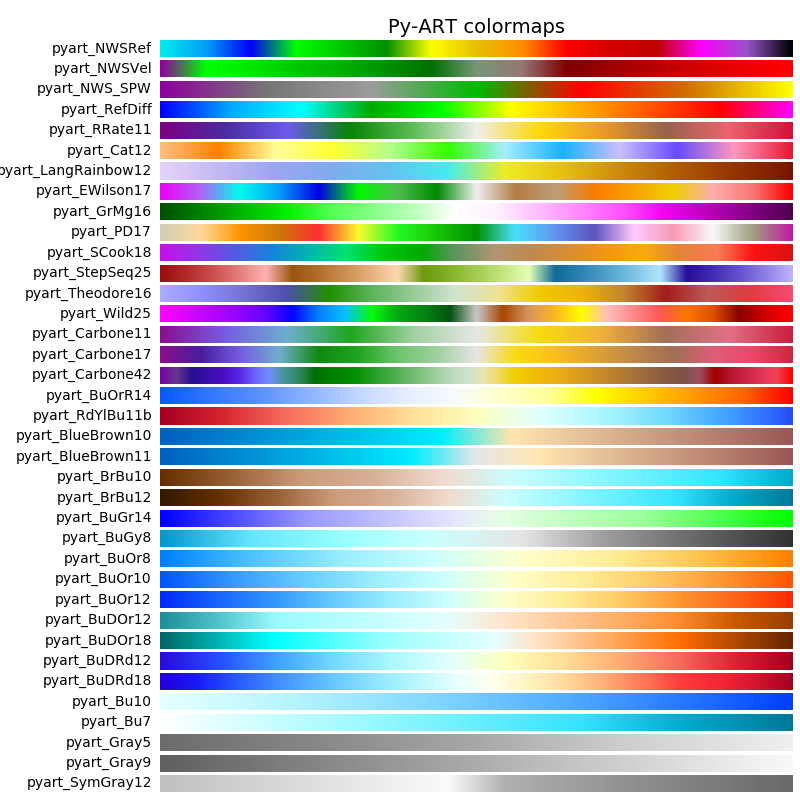

This repository contains figures of Radar fields created using the new field
specific colormaps and luminosity limits are proposed in 
[Py-ART pull request #464](https://github.com/ARM-DOE/pyart/pull/464).

If you have an opinion or comment on these defaults please post a comment to
the above pull request.

## Colormaps available in Py-ART

