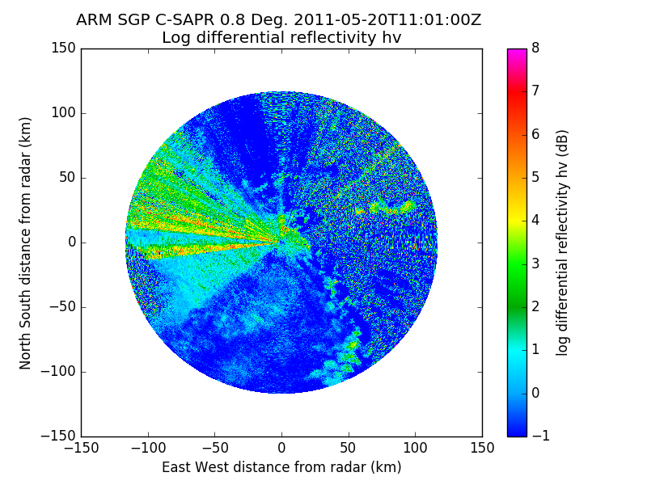
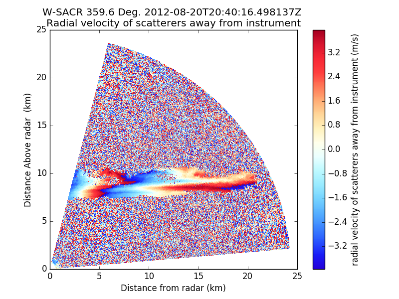
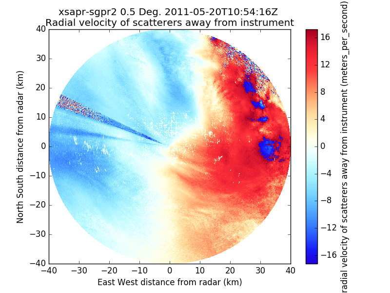

This repository contains figures of Radar fields created using the new field
specific colormaps and luminosity limits are proposed in 
[Py-ART pull request #464](https://github.com/ARM-DOE/pyart/pull/464).

If you have an opinion or comment on these defaults please post a comment to
the above pull request.

## Colormaps available in Py-ART

## NEXRAD
### Reflectivity

### Velocity

### Spectrum width

### Differential reflectivity

### Cross correlation ratio

### Differential phase

## CSAPR
### Reflectivity

### Velocity

### Spectrum width

### Normalized coherent power

### Differential reflectivity

### Cross correlation ratio

### Differential phase

### Specific differential phase

## WSACR
### Reflectivity

### Velocity

### SNR

### Linear depolarization ratio

## XSAPR
### Reflectivity

### Corrected reflectivity

### Total power

### Velocity

### Spectrum width

### Normalized coherent power

### Cross correlation ratio

### Differential phase

### Specific differential phase

### Radar echo classification

